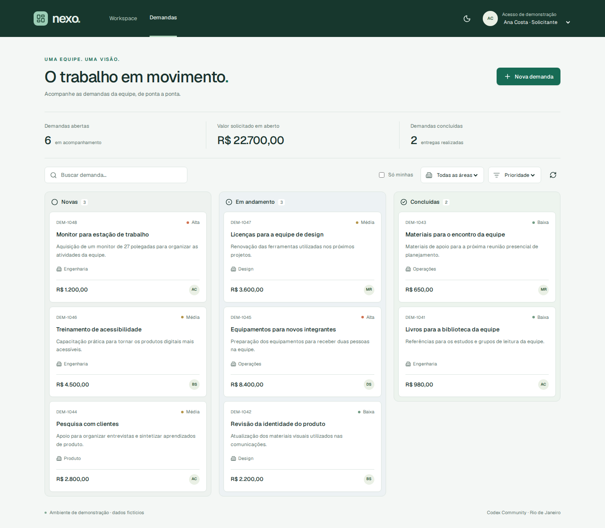

<a id="topo"></a>

<div align="center">

<p><strong>CODEX COMMUNITY MEETUP · RIO DE JANEIRO</strong></p>

<h1>Do PRD ao Pull Request com Codex</h1>

<p><strong>AI PDLC & Agentic Software Engineering</strong></p>

<p>Uma aplicação real para praticar o caminho entre entender um problema,<br>preparar o contexto e entregar uma mudança validada para revisão.</p>

<p><strong>19 de setembro de 2026 · Workshop 10h–13h30 · Q&A 13h30–14h</strong><br>Horário de Brasília · Com Glaucia Lemos</p>

<p>
  <a href="https://github.com/glaucia86/codex-ai-pdlc-workshop/actions/workflows/validate.yml"></a>
  <a href="LICENSE"></a>
  <a href="https://github.com/glaucia86/codex-ai-pdlc-workshop/stargazers"></a>
</p>

<p>
  <a href="https://nextjs.org/docs"></a>
  <a href="https://react.dev/"></a>
  <a href="https://www.typescriptlang.org/"></a>
  <a href="https://nodejs.org/en/download"></a>
</p>

<p>
  <a href="https://lucide.dev/"></a>
  <a href="https://zod.dev/"></a>
  <a href="https://playwright.dev/"></a>
  <a href="https://developers.openai.com/codex/cli/"></a>
</p>

<p>
  <a href="#o-projeto">O projeto</a> ·
  <a href="#preparacao">Preparar o ambiente</a> ·
  <a href="#executar">Executar</a> ·
  <a href="#codex">Configurar o Codex</a> ·
  <a href="#checklist">Checklist</a> ·
  <a href="#sobre-a-autora">Sobre mim</a>
</p>

</div>

---

<a id="o-projeto"></a>

## 🧭 Conheça o Nexo

O **Nexo** é um portal fictício de demandas internas. Este repositório contém o **starter**: a aplicação que você receberá funcionando para evoluir durante o workshop.

Você encontrará um quadro por situação, cadastro e edição de demandas, busca, filtros, valores, histórico e troca de perfis de demonstração. O frontend usa React, Next.js e Lucide Icons, com temas claro e escuro.

<div align="center">
  
  <p><sub>O ponto de partida da prática: um produto existente, com interface, backend e dados fictícios.</sub></p>
</div>

> **O desafio:** uma demanda com orçamento precisa passar pela aprovação de um gestor antes de entrar em execução. Vamos construir essa evolução juntos, desde o PRD até o PR com revisão de código.

O portal roda localmente com **persistência em arquivo JSON**, criada automaticamente pelo backend. Para executá-lo, você não precisa de banco de dados, Docker, arquivo `.env` ou chave de API. O acesso ao Codex é preparado separadamente.

### O que vamos praticar

| Momento | O que você vai aprender |
| --- | --- |
| Entender o problema | Escrever e revisar um PRD: o documento que explica a necessidade e os critérios de aceite. |
| Planejar a mudança | Criar a especificação técnica e dividir a entrega em slices: pequenas unidades implementáveis. |
| Preparar o agente | Organizar contexto, instruções, skills e validações para orientar o Codex. |
| Construir e conferir | Implementar por etapas, executar testes e preservar o comportamento existente. |
| Revisar e entregar | Avaliar os achados do code review, corrigir, validar e abrir um Pull Request. |

**Diferentes níveis são bem-vindos.** Conhecer o básico de JavaScript/TypeScript, terminal e Git ajuda. A preparação abaixo permite chegar com o ambiente pronto; os conceitos e artefatos serão trabalhados com a instrutora durante a prática.

<a id="preparacao"></a>

## 🧰 1. Prepare seu ambiente

Reserve um tempo **antes do evento** para concluir estas etapas.

| Ferramenta | Requisito | Para que serve |
| --- | --- | --- |
| [Node.js](https://nodejs.org/en/download) | **24.x** — a versão exigida pelo projeto | Executar o frontend, o backend e os scripts. |
| npm | Incluído na instalação do Node.js | Instalar as dependências pelo lockfile. |
| [Git](https://git-scm.com/install/) | Instalado e disponível no terminal | Clonar, criar a branch e versionar a entrega. |
| [Conta no GitHub](https://github.com/) | Login funcionando | Fazer seu fork e abrir o PR no seu repositório. |
| Editor e navegador | Seu editor preferido e um navegador atualizado | Explorar o código e usar o portal. |
| [Codex](https://developers.openai.com/codex/cli/) | Acesso testado antes da aula | Acompanhar a prática com o agente. |

**Use a linha 24 do Node.js.** O projeto declara `>=24 <25`; instalar apenas a versão mais recente pode selecionar uma linha diferente. As versões das bibliotecas já estão fixadas em [package.json](package.json) e [package-lock.json](package-lock.json).

Abra a orientação do seu sistema:

<details>
<summary><strong>🪟 Windows — Prompt de Comando ou PowerShell</strong></summary>

1. Baixe o [Node.js 24 para Windows](https://nodejs.org/en/download), selecione o instalador `.msi` e conclua a instalação com npm e PATH habilitados.
2. Instale o [Git para Windows](https://git-scm.com/install/windows).
3. Feche e abra novamente o terminal. Para um caminho simples, use o **Prompt de Comando (cmd)**, inclusive no terminal integrado do editor.
4. Confira as ferramentas:

```bat
node --version
npm --version
git --version
```

O primeiro comando deve mostrar `v24.x.x`. Os outros devem imprimir suas versões.

**Usando PowerShell?** Se aparecer “`npm.ps1` não pode ser carregado”, abra o Prompt de Comando ou use `npm.cmd` no lugar de `npm`. O mesmo vale para `npx.cmd` e `codex.cmd` se os respectivos scripts forem bloqueados. Não é necessário alterar a política de execução para seguir os comandos deste guia.

O portal funciona nativamente no Windows. Se você já usa WSL, instale Node.js, Git e as dependências dentro dele e mantenha o projeto nesse mesmo ambiente; não compartilhe `node_modules` entre Windows e Linux.

</details>

<details>
<summary><strong>🍎 macOS — Terminal com zsh ou bash</strong></summary>

1. Baixe o [Node.js 24 para macOS](https://nodejs.org/en/download) e instale o pacote `.pkg` adequado ao seu Mac.
2. Abra o **Terminal** e execute `git --version`. Se o Git não estiver disponível, instale as ferramentas de linha de comando da Apple:

```bash
xcode-select --install
```

Conclua a janela de instalação antes de continuar. Se você já usa Homebrew, `brew install git` é outra opção documentada no [guia do Git para macOS](https://git-scm.com/install/mac).

3. Abra um novo terminal e confira:

```bash
node --version
npm --version
git --version
```

O Node deve mostrar `v24.x.x`. Se você já gerencia suas versões com **nvm**, pode usar `nvm install 24` e `nvm use 24` em vez do instalador. Dentro do repositório, `nvm use` lê a versão definida em `.nvmrc`.

</details>

<details>
<summary><strong>🐧 Linux — Terminal com bash ou zsh</strong></summary>

1. Instale o Git com o gerenciador da sua distribuição. Em **Ubuntu/Debian**:

```bash
sudo apt-get update
sudo apt-get install git
```

Para Fedora, Arch e outras distribuições, consulte o [guia oficial do Git para Linux](https://git-scm.com/install/linux).

2. Abra a [página de instalação do Node.js](https://nodejs.org/en/download), selecione **Linux** e a versão **24.x** e siga as instruções para sua arquitetura. Se escolher nvm, conclua a [instalação oficial do nvm](https://github.com/nvm-sh/nvm#installing-and-updating), reabra o terminal e execute:

```bash
nvm install 24
nvm use 24
```

3. Confira as ferramentas:

```bash
node --version
npm --version
git --version
```

O Node deve mostrar `v24.x.x`. O pacote `nodejs` da sua distribuição pode usar outra versão: confirme antes de instalar as dependências do projeto.

Para os testes no navegador, veja também as [dependências do Chromium](#validar). Elas são uma etapa adicional à execução normal do portal.

</details>

<a id="executar"></a>

## 🚀 2. Faça seu fork e execute o portal

Um **fork** é sua cópia do projeto no GitHub. O **clone** traz essa cópia para seu computador.

1. Abra o [repositório do workshop](https://github.com/glaucia86/codex-ai-pdlc-workshop) e clique em **Fork → Create fork**. Copiar apenas `main` é suficiente.
2. No seu fork, clique em **Code → HTTPS** para encontrar a URL de clonagem.
3. Abra o terminal na pasta em que deseja guardar o projeto. No comando abaixo, substitua **`SEU-USUARIO` pelo seu usuário do GitHub**:

```sh
git clone --branch main https://github.com/SEU-USUARIO/codex-ai-pdlc-workshop.git
cd codex-ai-pdlc-workshop
npm ci
npm run doctor
npm run dev
```

Execute um comando por vez e avance quando ele terminar sem erros. `npm run dev` continuará em execução: deixe esse terminal aberto.

> **Abra [http://127.0.0.1:3000](http://127.0.0.1:3000) no navegador.** Você deverá ver o quadro do Nexo com demandas de exemplo. `npm run doctor` deverá mostrar os pré-requisitos locais como `OK`; ele não verifica o login no Codex.

Use `npm ci` para instalar as versões do lockfile. Os comandos acima são os mesmos em Windows, macOS e Linux; no PowerShell, aplique a alternativa `.cmd` se necessário.

<details>
<summary><strong>Quero apenas experimentar, sem fazer fork agora</strong></summary>

Clone a base original em vez do seu fork:

```sh
git clone --branch main https://github.com/glaucia86/codex-ai-pdlc-workshop.git
cd codex-ai-pdlc-workshop
npm ci
npm run doctor
npm run dev
```

Escolha **uma** das opções de clonagem. Para enviar sua entrega ao GitHub, o caminho com fork facilita a criação do PR no seu próprio repositório.

</details>

### Confira seu primeiro acesso

1. Selecione **Ana Costa** no seletor de perfil.
2. Crie uma demanda de teste, abra os detalhes e observe o histórico.
3. Recarregue a página: a demanda deve continuar no quadro.
4. Experimente os filtros e os temas claro e escuro.

Os perfis são fictícios, próprios para a aula. Cada pessoa edita e movimenta as demandas que criou. A aprovação de orçamento será adicionada durante o workshop.

<a id="validar"></a>

## ✅ 3. Verifique se está tudo funcionando

**Pare o servidor com `Ctrl+C`** antes da validação completa e dos testes no navegador. No mesmo terminal, dentro do projeto:

```sh
npm run validate
```

Esse comando verifica os tipos TypeScript, o lint, os testes e o build. O resultado esperado é **“Validação concluída”**.

Para verificar a interface automaticamente, instale o Chromium usado pelo Playwright:

| Sistema | Instalação do navegador de teste |
| --- | --- |
| Windows e macOS | `npx playwright install chromium` |
| Linux | `npx playwright install --with-deps chromium` |

No Linux, a opção `--with-deps` também instala bibliotecas do sistema e pode pedir senha de administrador. Consulte os [sistemas suportados](https://playwright.dev/docs/intro#system-requirements) e a [documentação do Playwright](https://playwright.dev/docs/browsers#install-system-dependencies) se sua distribuição não for atendida.

Depois, execute:

```sh
npm run test:e2e
```

O teste abre seu próprio servidor na **porta 3100** e usa dados separados. Você não precisa iniciar o portal manualmente para esse teste. Ao terminar, use `npm run dev` para voltar à aplicação.

O [workflow de validação](.github/workflows/validate.yml) executa tipos, lint, testes e build em **Windows, macOS e Linux**. A etapa de navegador da CI roda em Linux; o badge no topo mostra o status da branch `main`.

<a id="codex"></a>

## 🤖 4. Prepare seu acesso ao Codex

O Codex será usado para trabalhar no código do projeto. **O portal não faz chamadas à API de IA**, mas o agente precisa de conexão com o serviço e acesso pela sua conta.

Você pode usar o aplicativo que já utiliza com Codex, abrindo a pasta clonada, ou seguir pelo CLI. Confira as opções atuais na [documentação oficial do Codex](https://developers.openai.com/codex/cli/).

Para instalar pelo npm:

```sh
npm install -g @openai/codex
codex --version
```

Dentro da pasta `codex-ai-pdlc-workshop`, execute:

```sh
codex
```

Na primeira execução, siga o fluxo de login e escolha **Sign in with ChatGPT** se essa for a forma de acesso da sua conta. Confirme antes do evento que você consegue iniciar uma sessão no projeto. A disponibilidade e os limites dependem da sua conta; consulte as [opções de autenticação](https://developers.openai.com/codex/auth/).

No Windows, veja a [orientação oficial para o ambiente nativo](https://developers.openai.com/codex/windows/). Se você usa WSL, mantenha Codex e projeto no mesmo ambiente. Para erros de comando ou permissão de instalação, consulte a [preparação detalhada](docs/preparation.md#problemas-frequentes).

<a id="checklist"></a>

## 🎒 Checklist antes de sair de casa

- [ ] Node.js 24, npm e Git respondem no terminal.
- [ ] Fiz meu fork, clonei a branch `main` e instalei com `npm ci`.
- [ ] `npm run doctor` exibiu todos os itens locais como `OK`.
- [ ] Abri o Nexo, criei uma demanda e confirmei que ela permanece ao recarregar.
- [ ] `npm run validate` e `npm run test:e2e` terminaram sem falhas.
- [ ] Consegui acessar o Codex e abrir a pasta do projeto.
- [ ] Meu login no GitHub funciona para publicar a entrega no meu fork.
- [ ] Separei notebook e carregador.

Encontrou um bloqueio? Consulte [preparação e solução de problemas](docs/preparation.md). Se precisar de ajuda no evento, mostre a mensagem de erro e a etapa em que parou.

<a id="durante-o-workshop"></a>

## 🛠️ Durante o workshop

Abra o projeto no editor e leia o [enunciado da nova necessidade](docs/workshop-brief.md). Para começar sua implementação em uma branch própria:

```sh
git switch -c feature/aprovacao-orcamento
```

Se já criou essa branch, use `git switch feature/aprovacao-orcamento`.

**Acompanhe a sequência da instrutora.** Os prompts, templates e orientações de cada etapa serão apresentados durante a aula. Ao final, a entrega será uma mudança validada, revisada e enviada como PR no seu fork, da branch da feature para a sua `main`.

| Horário — Brasília | Atividade |
| --- | --- |
| **10h–13h30** | Conceitos, demonstrações e prática guiada. |
| **13h30–14h** | Q&A: perguntas e troca de experiências. |

Se precisar retomar uma etapa, peça à instrutora a referência adequada e siga o [guia de recuperação por checkpoint](docs/checkpoints.md). Ele usa outra pasta para preservar sua tentativa anterior.

<a id="comandos"></a>

## ⌨️ Comandos para ter à mão

Execute na raiz do projeto, onde está `package.json`.

| Comando | O que faz |
| --- | --- |
| `npm ci` | Instala as dependências nas versões do lockfile. |
| `npm run doctor` | Confere Node.js 24, Git, dependências e dados fictícios. |
| `npm run dev` | Inicia o portal em `http://127.0.0.1:3000`. |
| `npm test` | Testa regras, API e persistência com dados temporários. |
| `npm run lint` | Verifica o código com ESLint. |
| `npm run typecheck` | Verifica os tipos TypeScript. |
| `npm run validate` | Executa tipos, lint, testes e build; para na primeira falha. |
| `npm run test:e2e` | Testa a interface em Chromium, com servidor e dados próprios. |
| `npm run data:reset` | Restaura os exemplos após confirmação e preserva backup. |
| `npm run build` | Gera o build da aplicação. |
| `npm start` | Executa o build local, depois de `npm run build`. |

### Precisa restaurar os dados?

Pare o servidor com `Ctrl+C`, execute `npm run data:reset` e confirme com `s`. Os dados anteriores ficam em um backup ao lado do arquivo de trabalho. Reinicie com `npm run dev`.

Para JSON inválido ou trava após encerramento abrupto, siga a [recuperação de dados e trava](docs/preparation.md#recuperação-de-dados-e-trava).

<a id="explorar"></a>

## 📚 Explore o projeto

| Caminho | O que você encontra |
| --- | --- |
| [`src/app/`](src/app/) | Páginas Next.js e endpoints da API. |
| [`src/components/`](src/components/) | Quadro, formulários e detalhes em React. |
| [`src/domain/`](src/domain/) | Tipos, validação e regras de negócio. |
| [`src/server/`](src/server/) | Tratamento das requisições e persistência JSON. |
| [`data/seed.json`](data/seed.json) | Cenário fictício usado para iniciar e restaurar o portal. |
| [`tests/`](tests/) | Testes de regras, API, persistência e interface. |
| [`AGENTS.md`](AGENTS.md) | Instruções iniciais para o agente. |
| [`CONTEXT.md`](CONTEXT.md) | Glossário do produto. |
| [`docs/architecture.md`](docs/architecture.md) | Organização e decisões técnicas do starter. |
| [`docs/workshop-brief.md`](docs/workshop-brief.md) | Ponto de partida da nova necessidade de produto. |

O alvo é **uma instância local por participante**. JSON e perfis fictícios simplificam a prática; a operação em produção exigiria decisões próprias de armazenamento, identidade, infraestrutura e observabilidade.

Projeto comunitário e independente para ensino, sem vínculo de produto oficial com a OpenAI. Código sob a [licença MIT](LICENSE).

---

<a id="sobre-a-autora"></a>

## 👩🏽‍💻 Sobre mim

<div align="center">

<a href="https://github.com/glaucia86">
  
</a>

<h3>Glaucia Lemos</h3>

<p><strong>Principal Software Engineer · Educadora · Criadora de conteúdo</strong></p>

<p>Sou engenheira de software e compartilho conhecimento sobre JavaScript, TypeScript,<br>Node.js, Cloud e Inteligência Artificial. Gosto de conectar teoria e prática<br>e de contribuir com comunidades de tecnologia e projetos open source.</p>

<p>Acompanhe meus conteúdos, tutoriais e conversas sobre engenharia de software com IA:</p>

<p>
  <a href="https://www.youtube.com/user/l32759"></a>
  <a href="https://www.linkedin.com/in/glaucialemos/"></a>
  <a href="https://x.com/glaucia_lemos86"></a>
</p>

<p>
  <a href="https://github.com/glaucia86"></a>
  <a href="https://www.twitch.tv/glaucia_lemos86"></a>
  <a href="https://dev.to/glaucia86"></a>
</p>

<p><em>Compartilhar conhecimento é multiplicar possibilidades. 💚</em></p>

<p><a href="#topo">↑ Voltar ao topo</a></p>

</div>
